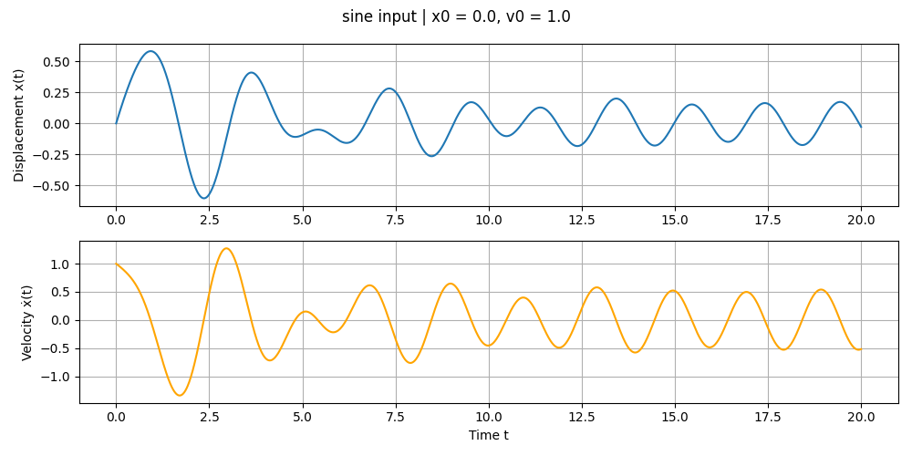

# 🌀 Mass-Spring-Damper Simulator (Torch)

This project simulates a **mass-spring-damper (MSD)** system using **PyTorch** for numerical integration and **Matplotlib** for visualization. The simulation models the system's time-domain response to a sinusoidal external force.

---

## 🧠 Background

A mass-spring-damper system is a classic second-order mechanical system governed by the differential equation:

m * x''(t) + d * x'(t) + c * x(t) = F(t)


Where:
- `m` is the mass,
- `d` is the damping coefficient,
- `c` is the spring stiffness,
- `F(t)` is the external force applied (in this simulation: sinusoidal),
- `x(t)` is displacement, and `x'(t)` is velocity.

---

## 🛠️ Technologies Used

- 🐍 **Python 3**
- 🔥 **PyTorch** – used for tensor operations and numerical integration
- 📊 **Matplotlib** – used for plotting displacement and velocity over time

---

## 📁 File Overview

- `msd_simulator.py`:  
  Main script that:
  - Defines system parameters
  - Simulates motion via numerical integration
  - Plots the results

---

## ⚙️ Parameters Used

```python
m = 1.0    # mass (kg)
d = 0.5    # damping coefficient
c = 4.0    # spring constant
F(t) = sin(2π·0.5·t)  # external sinusoidal force
```

- Initial conditions:
  - Displacement: x(0) = 0
  - Velocity: x'(0) = 1

---

## 📈 Output

The script produces two plots:
1. **Displacement** over time
2. **Velocity** over time

These plots show the damped oscillatory behavior under sinusoidal excitation.

---

## ▶️ How to Run

### 1. Install dependencies:

```bash
pip install torch matplotlib
```

### 2. Run the script:

```bash
python msd_simulator.py
```

The simulation will run and display the displacement and velocity plots.

---

## 🧪 Simulation Plot



_(Note: Image shown here is an example illustration of a damped oscillator)_

---

## 📌 Notes

- This is a basic simulation using explicit Euler integration (via forward stepping in PyTorch).
- You can modify parameters to simulate different types of damping (under/over/critical).

---

## 📚 References

- [Wikipedia: Damped Harmonic Oscillator](https://en.wikipedia.org/wiki/Damped_harmonic_oscillator)
- [PyTorch Documentation](https://pytorch.org/docs/stable/index.html)
- [Matplotlib Documentation](https://matplotlib.org/stable/contents.html)

---

## 📜 License

This project is for educational use. Feel free to modify and experiment!
